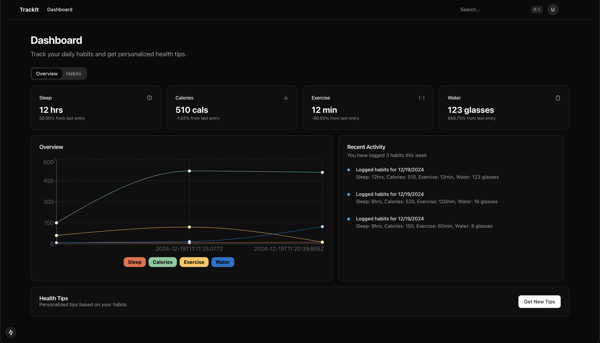

# Trackit
TrackIt is a web-based app where users can log their daily habits such as meals, exercise, sleep, and water intake. The app securely stores this data and uses AI to analyze patterns and provide personalized health recommendations. It also visualizes the data with charts to help users track their progress over time.

> [!TIP]
> This was a fun experiment i did for myself by challenging to make an app with only AI tools and not with my skills. And it came promising enough. I spent only 2 hours into this

### Tools
- Azure OpenAI
- Azure CosmosDB
- Github Copilot
- ShadcnUI

